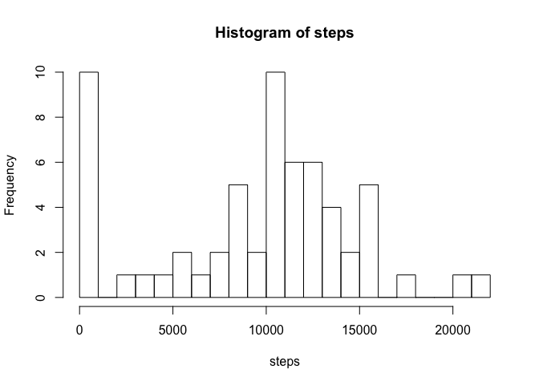
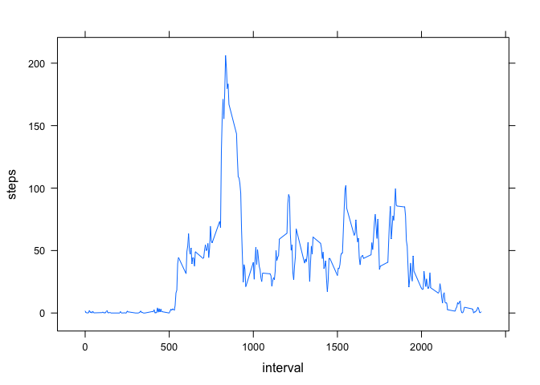
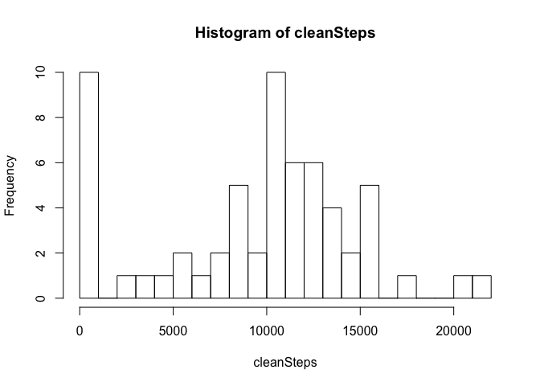
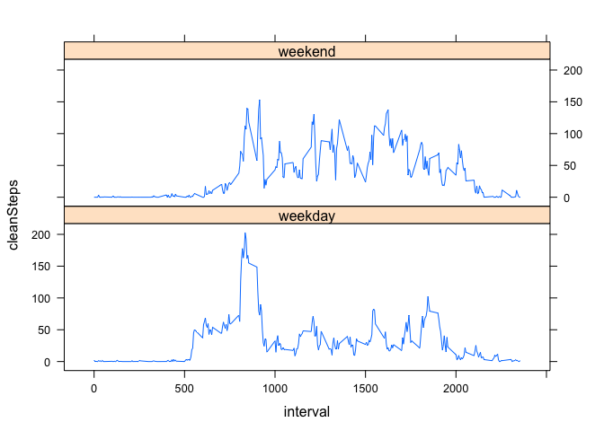

# Reproducible Research: Peer Assessment 1


## Loading and preprocessing the data

Load libraries, then read the data file and unzip it. No preprocessing it needed.

```r
library(lattice)
data <- read.csv( unz("activity.zip","activity.csv") )
```


## What is mean total number of steps taken per day?

Calculate the number of steps per day

```r
steps <- tapply(data$steps, data$date, sum, na.rm=TRUE)
```

Histogram of number of steps per day

```r
hist( steps, 20 )
```

 

Calculate the mean and median

```r
stepMean <- mean( steps )
stepMedian <- median(steps)
```

The mean of the number of steps per day is 9354.2295082  
The median of the number of steps per day is 10395  


## What is the average daily activity pattern?

Compute the steps per interval over all days and plot it

```r
stepsPerInterval <- aggregate(steps ~ interval, data=data, FUN=mean)
xyplot( steps ~ interval, data=stepsPerInterval, type="l" )
```

 

Determine the interval with the maximum number of steps

```r
maxSelector <- which(stepsPerInterval$steps==max(stepsPerInterval$steps))
maxInterval <- stepsPerInterval$interval[maxSelector]
maxSteps <- stepsPerInterval$steps[maxSelector]
```

The interval with the maximum number of steps is 835 with a average of 206.1698113 steps. 


## Imputing missing values

Calculate the number of missing values

```r
numberOfNA <- sum(is.na(data$steps))
```
The number of missing values is 2304

Clean the data with the following algorithm:
1) calculate the mean number steps on each day (ignoring missing values)
2) Replace all missing values with the mean for the corresponding day
Add a new column to the data frame with cleaned data

```r
intervalMean <- tapply(data$steps, data$date, mean, na.rm=TRUE)
intervalMean[is.na(intervalMean)] = 0

data$cleanSteps <- sapply( 1:length(data$steps), function(i) { if(is.na(data$steps[i])) return(intervalMean[data$date[i]]) else return(data$steps[i]) })
```
Calculate the number of steps per day with the clean data

```r
cleanSteps <- tapply(data$cleanSteps, data$date, sum, na.rm=TRUE)
```

Histogram of number of steps per day

```r
hist( cleanSteps, 20 )
```

 

Calculate the mean and median with the clean data

```r
cleanStepMean <- mean( cleanSteps )
cleanStepMedian <- median(cleanSteps)
```

The mean of the number of steps per day in the cleaned data is 9354.2295082  
The median of the number of steps per day in the cleaned data is 1.0395\times 10^{4}  

Although imputing data could have altered the appearance of the histogram or the mean/median, for this particular algorithm there was no noticable change in the results

## Are there differences in activity patterns between weekdays and weekends?

Factor the data by weekend vs weekday and plot results

```r
# Extract days from data and create a weekend column in the data table
days <- weekdays(strptime(data$date,format="%Y-%m-%d"))
weekend <- days=="Sunday" | days=="Saturday"
data$weekend <- factor(weekend, c(FALSE,TRUE), c("weekday","weekend"))

# plot using panel plots

meanData <- aggregate(cleanSteps ~ weekend + interval, data=data, FUN=mean)
xyplot( cleanSteps ~ interval | weekend, data=meanData, type="l", layout=c(1,2) )
```

 

Notice there is difference in the distribution of the number of steps between weekend and weekday.
